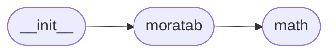

# Code Overview

[_Documentation generated by Documatic_](https://www.documatic.com)

<!---Documatic-section-Codebase Structure Python-start--->
## Codebase Structure Python

The codebase has a flat structure, with 3 code files.

<!---Documatic-block-system_architecture-start--->

<!---Documatic-block-system_architecture-end--->

# #
<!---Documatic-section-Codebase Structure Python-end--->

<!---Documatic-section-Key Objects-start--->
## Key Objects

There are exposed imports at level-0
from the source directory (moratab)

<!---Documatic-block-moratab-start--->

	
<code>moratab</code> (Click to Expand!)

* `moratab.moratab.Moratab`
* `moratab.moratab.append_simple_footnotes`
* `moratab.moratab.direction`
* `moratab.moratab.ltr`
* `moratab.moratab.markdown`
* `moratab.moratab.number_translation`
* `moratab.moratab.refine`
* `moratab.moratab.render`

<!---Documatic-block-moratab-end--->

# #
<!---Documatic-section-Key Objects-end--->

<!---Documatic-section-Important Functions-start--->
## Important Functions

<!---Documatic-block-important_funcs-start--->
<!---Documatic-block-most_used_funcs-start--->
### Most Utilised Functions

* [moratab.moratab.append_simple_footnotes](3-moratab_moratab.md#moratab.moratab.append_simple_footnotes) (1 times)
* moratab.moratab.direction (1 times)
* moratab.moratab.ltr (1 times)
* moratab.moratab.markdown (1 times)
* moratab.moratab.number_translation (1 times)
* moratab.moratab.refine (1 times)
* [moratab.moratab.render](3-moratab_moratab.md#moratab.moratab.render) (1 times)
<!---Documatic-block-most_used_funcs-end--->

<!---Documatic-block-end_user_funcs-start--->
### End User Exposed Functions

* moratab.moratab.markdown
* [moratab.moratab.append_simple_footnotes](3-moratab_moratab.md#moratab.moratab.append_simple_footnotes)
* moratab.moratab.direction
* moratab.moratab.Moratab
* moratab.moratab.refine
* moratab.moratab.ltr
* moratab.moratab.number_translation
* [moratab.moratab.render](3-moratab_moratab.md#moratab.moratab.render)
<!---Documatic-block-end_user_funcs-end--->
<!---Documatic-block-important_funcs-end--->

# #
<!---Documatic-section-Important Functions-end--->

<!---Documatic-section-Class Hierarchy-start--->
## Class Hierarchy

<!---Documatic-block-Renderer-start--->

	
<code>Renderer</code> (Click to Expand!)

* moratab.moratab.Moratab

<!---Documatic-block-Renderer-end--->

<!---Documatic-block-mistune.BlockGrammar-start--->

	
<code>mistune.BlockGrammar</code> (Click to Expand!)

* moratab.math.MathBlockGrammar

<!---Documatic-block-mistune.BlockGrammar-end--->

<!---Documatic-block-mistune.BlockLexer-start--->

	
<code>mistune.BlockLexer</code> (Click to Expand!)

* moratab.math.MathBlockLexer

<!---Documatic-block-mistune.BlockLexer-end--->

<!---Documatic-block-mistune.InlineGrammar-start--->

	
<code>mistune.InlineGrammar</code> (Click to Expand!)

* moratab.math.MathInlineGrammar

<!---Documatic-block-mistune.InlineGrammar-end--->

<!---Documatic-block-mistune.InlineLexer-start--->

	
<code>mistune.InlineLexer</code> (Click to Expand!)

* moratab.math.MathInlineLexer

<!---Documatic-block-mistune.InlineLexer-end--->

<!---Documatic-block-mistune.Markdown-start--->

	
<code>mistune.Markdown</code> (Click to Expand!)

* moratab.math.MarkdownWithMath

<!---Documatic-block-mistune.Markdown-end--->

# #
<!---Documatic-section-Class Hierarchy-end--->

[_Documentation generated by Documatic_](https://www.documatic.com)