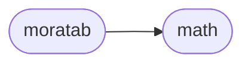

# Moratab Moratab

[_Documentation generated by Documatic_](https://www.documatic.com)

<!---Documatic-section-Codebase Structure-start--->
## Codebase Structure

<!---Documatic-block-system_architecture-start--->

<!---Documatic-block-system_architecture-end--->

# #
<!---Documatic-section-Codebase Structure-end--->

<!---Documatic-section-moratab.moratab.append_simple_footnotes-start--->
## [moratab.moratab.append_simple_footnotes](3-moratab_moratab.md#moratab.moratab.append_simple_footnotes)

<!---Documatic-section-append_simple_footnotes-start--->
<!---Documatic-block-moratab.moratab.append_simple_footnotes-start--->
<details>
	<summary><code>moratab.moratab.append_simple_footnotes</code> code snippet</summary>

```python
def append_simple_footnotes(text):
    for footnote in re.finditer('\\[\\^([^\\]]+)\\]', text):
        ref = footnote.group(1)
        if not '[^{0}]:'.format(ref) in text:
            text += '\n[^{0}]: {0}'.format(ref)
    return text
```
</details>
<!---Documatic-block-moratab.moratab.append_simple_footnotes-end--->
<!---Documatic-section-append_simple_footnotes-end--->

# #
<!---Documatic-section-moratab.moratab.append_simple_footnotes-end--->

<!---Documatic-section-moratab.moratab.render-start--->
## [moratab.moratab.render](3-moratab_moratab.md#moratab.moratab.render)

<!---Documatic-section-render-start--->


### Object Calls

* [moratab.moratab.append_simple_footnotes](3-moratab_moratab.md#moratab.moratab.append_simple_footnotes)

<!---Documatic-block-moratab.moratab.render-start--->
<details>
	<summary><code>moratab.moratab.render</code> code snippet</summary>

```python
def render(text, header_numbers=False):
    text = append_simple_footnotes(text)
    markdown.renderer.header_numbers = header_numbers
    markdown.renderer.last_header = []
    return markdown.render(text)
```
</details>
<!---Documatic-block-moratab.moratab.render-end--->
<!---Documatic-section-render-end--->

# #
<!---Documatic-section-moratab.moratab.render-end--->

[_Documentation generated by Documatic_](https://www.documatic.com)